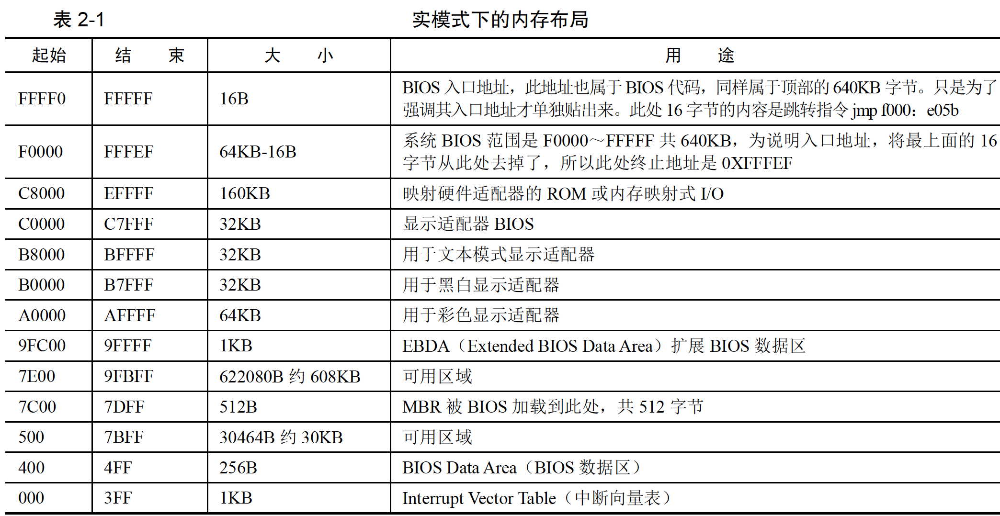

## 实模式下的1MB 内存布局
先来点背景知识，很久很久以前：
Intel 8086 有20 条地址线，故其可以访问1MB 的内存空间，即2^20=1048576=1MB
按十六进制来表示，是0x00000 到0xFFFFF。

在开机的一瞬间，也就是接电的一瞬间，CPU 的cs：ip 寄存器被强制初始化为0xF000：0xFFF0。
由于开机的时候处于实模式，在实模式下0xF000：0xFFF0 的等效地址将是0xFFFF0。此地址便是BIOS 的入口地址。

注意BIOS 是在实模式下运行的，而实模式只能访问1MB 空间（20 位地址线，2 的20 次方是1MB）。
而地址0xFFFF0 距1MB 只有16 个字节
物理地址0xFFFF0 处的内容是一条跳转指令， jmp far f000：e05b

段址0xf000 左移4 位+0xe05b，即跳向了0xfe05b 处，这是BIOS 代码真正开始的地方。

接下来 BIOS 检测内存、显卡等外设信息，当检测通过，并初始化好硬件后，开始在内存中`0x000～0x3FF` 处建立数据结构，中断向量表IVT 并填写中断例程。

BIOS 跳转到0x7c00 是用jmp 0：0x7c00 实现的，这是jmp 指令的直接绝对远转移用法，段寄存器cs 会被替换，这里的段基址是0，即cs 由之前的0xf000 变成了0。

## 为什么是0x7c00
最早的BIOS是按最小内存32KB 研发的。
MBR 不是随便放在哪里都行的，首先不能覆盖已有的数据，其次，不能过早地被其他数据
8086CPU 要求物理地址0x0～0x3FF 存放中断向量表
按 DOS 1.0 要求的最小内存32KB 来说，MBR 希望给人家尽可能多的预留空间，这样也是保全自己
的作法，免得过早被覆盖。所以MBR 只能放在32KB 的末尾
MBR 虽然本身只有512 字节，但还要为其所用的栈分配点空间，所以其实际所用的内存空间要大于512 字节，估计1KB 内存够用了。
32KB换算为十六进制为0x8000，减去1KB(0x400)的话，等于0x7c00

